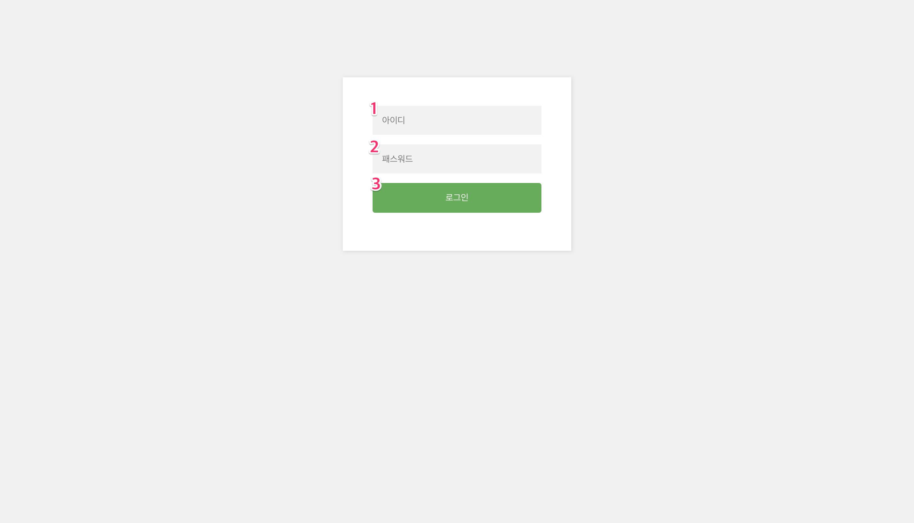
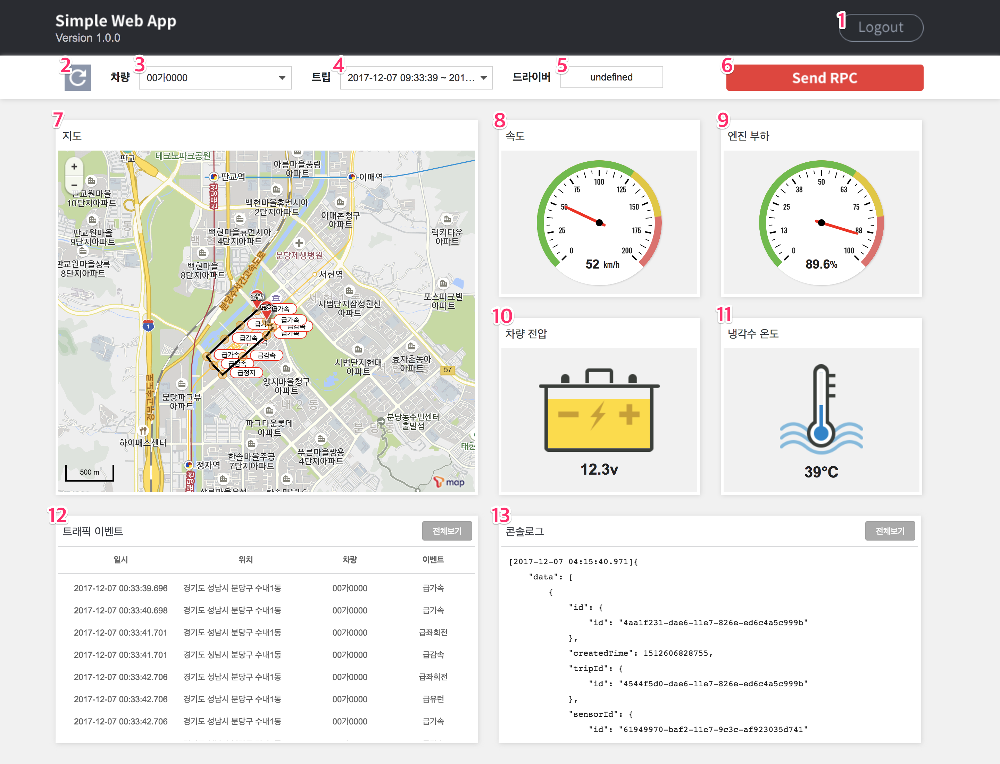
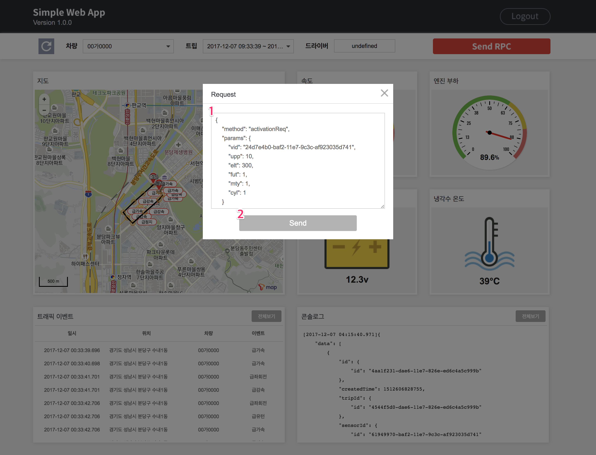
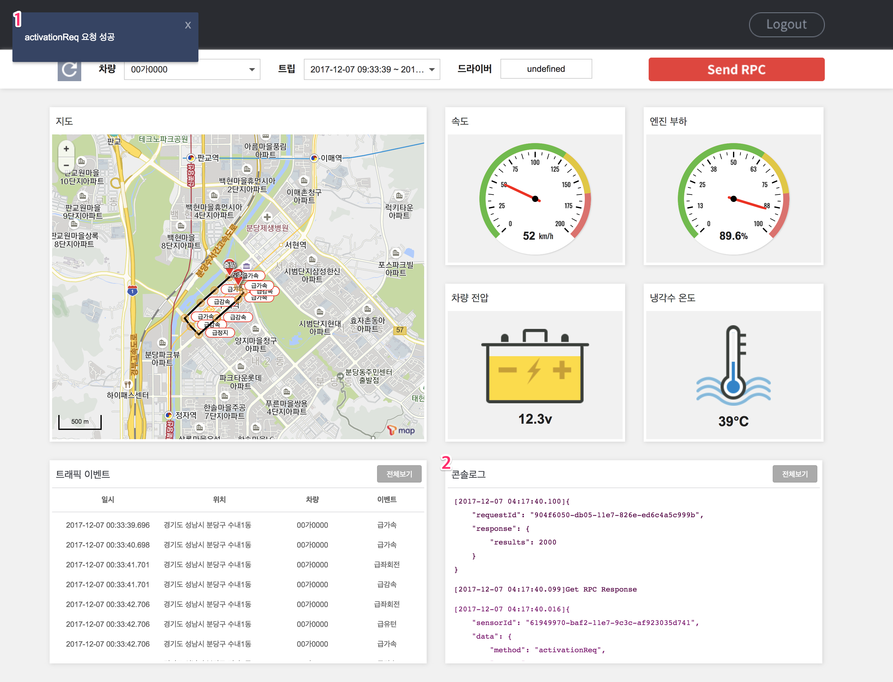

# Simple Wep App
Simple Wep App for T-RemotEye Test

## 1. 설치

```
git clone https://github.com/skt-smartfleet/simpleweb
cd tre-simpleweb
npm install
```

## 2. 설정

실행하기 전에 파일 혹은 파라미터로 **port, appkey** 를 먼저 설정한다.
appkey에 [SK텔레콤 개발자센터](https://developers.sktelecom.com/)에서 제공하는 인증 키를 입력한다. 인증 키는 T map biz API 서비스를 이용할 수 있어야 한다.
기본 포트는 3000이다. (상용화 시 계약 필요)

### 2.1. 파일 수정(config.js)

```
cd tre-simpleweb
vi config.js

module.exports = {
  ...
  appkey : 0000-0000-000-0000, //인증 키 설정
  port : 3000 //포트 설정
  ...
}
```

### 2.2. 파라미터 전달(패키지 파일 사용하는 경우)

```
./{패키지 파일 이름} --port={port_num} --appkey={tmap_app_key}
```
ex) `./simple-web-app-macos --port=3000 --appkey=0000-0000-0000-0000`

## 3. 실행

### 3.1 프로젝트 실행

```
cd tre-simpleweb
npm start
```

### 3.2 패키지 파일 실행

```
cd tre-simpleweb
cd exe
{패키지 파일 이름}
```
ex) `./simple-web-app-macos`

OS별 실행 패키지
* Linux : simple-web-app-linux
* MAC OS : simple-web-app-macos
* Windows : simple-web-app-win.exe

## 4. 사용 방법

### 4.1. 접속

`http://localhost:{port}`에 접속한다. 설정에서 포트 값이 3000이면 주소는 http://<span></span>localhost:3000이 된다.

### 4.2. 로그인



처음 접속하면 로그인 페이지로 이동한다.

아이디<sup>1</sup>, 패스워드<sup>2</sup>란에 자신의 [Smart Fleet](http://smartfleet.sktelecom.com/) 계정을 입력한다.

계정이 없을 경우 [Smart Fleet](http://smartfleet.sktelecom.com/) 에서 계정을 생성한다.
로그인할 때 계정에 회사, 차량, 센서 정보가 정상적으로 등록되어 있어야 한다. 그렇지 않으면 자동으로 로그아웃된다.
위의 엔티티 또한 [Smart Fleet](http://smartfleet.sktelecom.com/) 통해 등록할 수 있다.

로그인 버튼<sup>3</sup> 클릭 후 인증 성공하면 Simple Web App 페이지로 이동한다.

### 4.3. Simple Wep App



#### 4.3.1. 계정 변경

로그인 정보는 현재 세션 동안 유지한다. 이용 도중에 계정을 바꾸려면 로그아웃<sup>1</sup> 버튼을 눌러 로그아웃해야 한다.

#### 4.3.2. 리스트 업데이트

새로고침<sup>2</sup> 버튼을 눌러 차량/센서/트립 리스트를 최신 정보로 업데이트한다.

#### 4.3.2. 차량 및 트립 선택

차량 및 트립 정보는 아래 콤보 박스에서 선택할 수 있다.

* 차량 콤보 박스<sup>3</sup> : 계정이 관리하는 차량 리스트
* 트립 콤보 박스<sup>4</sup> : 차량 콤보 박스<sup>3</sup>에서 선택한 차량의 트립 리스트

차량, 트립 순으로 선택한다. 트립을 선택하면 해당 트립에 대한 정보가 드라이버<sup>5</sup>, 대시보드<sup>7~13</sup>에 반영된다.

드라이버<sup>5</sup>란에는 트립 당시 차량과 매핑되어 있던 운전자 이름을 표시한다.

#### 4.3.3. 대시보드

대시보드는 크게 4가지로 구성된다.

* 지도<sup>7</sup> : 운행 정보를 지도에 나타낸다. 시작 위치는 출발 마크, 마지막 위치는 도착 마크로 구분한다. 해당 위치에 트래픽 이벤트가 발생했으면 같이 표시한다.
* 게이지<sup>8~11</sup> : 선택된 차량의 운행 정보를 다양한 게이지 차트로 나타낸다. 냉각수 온도는 Trip 데이터, 나머지 게이지는 Microtrip 데이터를 표시한다.
* 트래픽 이벤트<sup>12</sup> : 트립 당시 발생한 트래픽 이벤트를 표로 나열한다. 전체보기 버튼을 제공한다.
* 콘솔로그<sup>13</sup> : 운행 정보를 JSON 형태로 기록한다. 로그는 시간 역순으로 나열된다. 가장 최신 로그가 상단에 위치한다. 전체보기 버튼을 제공한다.

#### 4.3.4. RPC Request

RPC 요청을 보내기 전에 먼저 차량 콤보 박스<sup>3</sup>에서 차량을 선택해야 한다. 차량을 선택하면 차량과 매핑된 센서로 RPC 요청을 보낸다.

Send RPC<sup>6</sup> 버튼을 클릭하면 아래와 같이 팝업 창이 나타난다.



Request 입력창<sup>1</sup>에는 센서로 보낼 RPC Request 파라미터를 입력한다. 파라미터는 JSON 형태여야 한다. 처음에는 Activation 이벤트 파라미터로 자동 설정된다.

Send<sup>2</sup> 버튼을 클릭하면 입력한 파라미터로 RPC 요청을 보낸다.



RPC 요청 결과는 토스트 메시지<sup>1</sup>로 알려준다. 또한 RPC Request 및 Response 파라미터는 콘솔 로그<sup>2</sup>에 기록된다.

## 5. 활용 예시

### 5.1. T-RemotEye Device Simulator 활용

Device Simulator를 실행하면 시뮬레이터에서 전송한 Trip 정보를 Simple Web App에서 확인할 수 있다.

[Device Simulator 다운로드](https://github.com/skt-smartfleet/device-simulator)

### 5.2. 외부개발자가 개발한 SDK를 활용 (Embadded-C, Android, Object-C 및 Java)

SKD에서 전송한 Trip 정보를 Simple Web App에서 확인할 수 있다. Simple Web App에서 Send RPC를 클릭하면 SDK로 RPC Request를 보낸다. SDK가 RPC Request를 정상적으로 받으면 요청 성공했다는 토스트 메시지가 나타난다.
